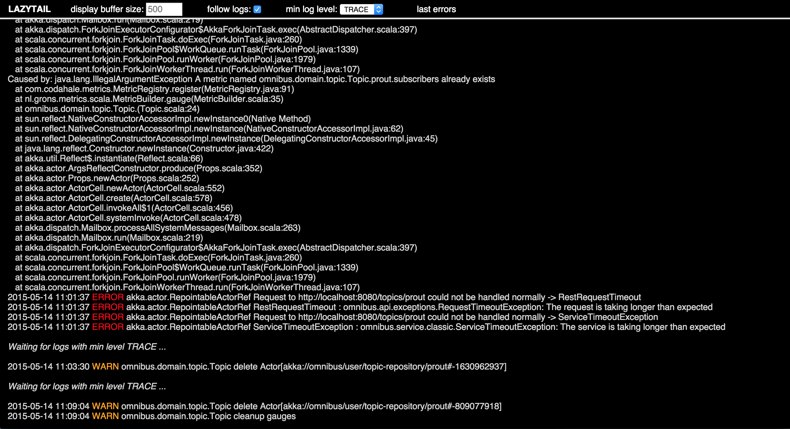

lazy-tail [](https://travis-ci.org/agourlay/lazy-tail) [  ](https://bintray.com/agourlay/maven/lazy-tail/_latestVersion)
=========

Tired of geeks telling you to SSH into ```server.prod.bigcoorp``` to read log files, tired of hipsters telling you to set up an Elasticsearch cluster to see some fancy dashboards?

Here comes lazy-tail - a library exposing the logs of any host application using Logback to the Web!



## APIs

Let's start by creating an instance of the ```LazyTail``` class, as an optional argument it takes the LoggerName you want to expose. (by default "ROOT")

then 2 alternatives are currently available:

```scala
// starts an HTTP server on the provided port to expose logs.
def start(port: Int): Unit 

// returns an Akka-http Route containing the lazy-tail logic.
def route()(implicit system: ActorSystem): server.Route
 
```

## Endpoints

- /logs to access the slick web frontend.
- /logs/tail with the optional HTTP param 'minLevel' to subscribe to the SSE stream of logs.
- /logs/lastErrors to retrieve the last ERROR logs kept in memory.

## Installation

To be released soon...

lazy-tail depends on akka-http 1.0-RC2.

``` scala
resolvers += "agourlay at bintray" at "http://dl.bintray.com/agourlay/maven"

libraryDependencies ++= List(
  "com.github.agourlay" %% "lazy-tail" % "0.1.2",
  ...
)
```

## Todos

- Websocket support when available in Akka-http.
- retrieve/specify a log pattern for the display field of the log.
